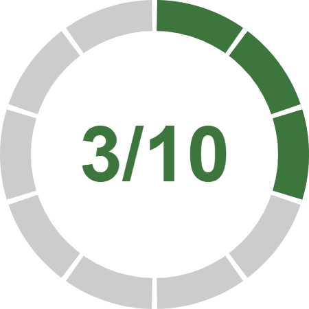

# radial-progress-indicator

A React component that displays a customisable circular progress gauge.

**🚧 👩‍💻 Proceed with caution, work in progress 👨‍💻 🚧**

This component displays a circular progress gauge, useful for displaying progress on a completeable action, like:

* “you’re on step 3/10”, or 
* “you're 30% there”

## Features

* The graphic is drawn using HTML5 canvas.
* Optimised to natively draw at the correct pixel density for the user's screen.
* Tweakable props to set various colours and layout metrics.
* Animatable between steps.

## Demo

* Have a look at [this storybook](https://twisty.github.io/radial-progress-indicator/).

## Install

**todo**

## Usage

**todo**
