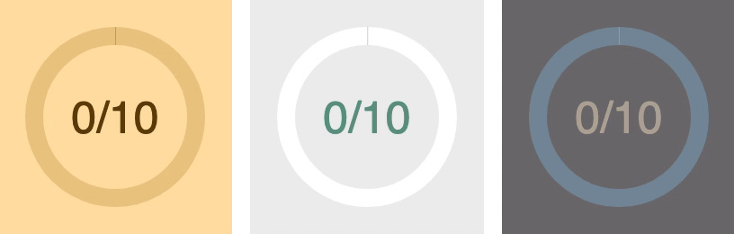

[](https://bundlephobia.com/result?p=react-radial-progress-indicator)
[](https://github.com/twisty/react-radial-progress-indicator/issues)
[](https://www.codefactor.io/repository/github/twisty/react-radial-progress-indicator)
[](https://github.com/twisty/react-radial-progress-indicator/blob/master/LICENSE)

# react-radial-progress-indicator

A React component that displays a customisable circular progress indicator.

The indicator can display segmented steps (like “you’re on step 3/10”), or a smooth sweep to any position around the ring (useful when progress is measured as a percentage).

## Features

* **Lightweight:** [~2kb when minified and gzipped](https://bundlephobia.com/result?p=react-radial-progress-indicator). No runtime dependencies.
* **Responsive:** draws natively at the pixel density of your screen using HTML5 canvas.
* **Tweakable:** colours, layout metrics, and text can be fine-tuned for your layout.
* **Animatable:** animates between steps with customisable speed.

## Install

Install with yarn…

```
yarn add react-radial-progress-indicator
```

…or npm:

```
npm install react-radial-progress-indicator
```

## Examples



For examples and usage, have a look at [this storybook](https://twisty.github.io/react-radial-progress-indicator/).

## Usage

```jsx
import React from 'react'
import { RadialProgress } from 'react-radial-progress-indicator';

const UsageExample = (props) => {
  return (
    <RadialProgress
      width={100}
      height={100}
      steps={10}
      step={3}
    />
  );
);
```

See the `jsx` tab in [the storybook](https://twisty.github.io/react-radial-progress-indicator/) for more usage examples.

## API

A full list of `props` available to customise the component can be found here: [docs/api.md](docs/api.md)
